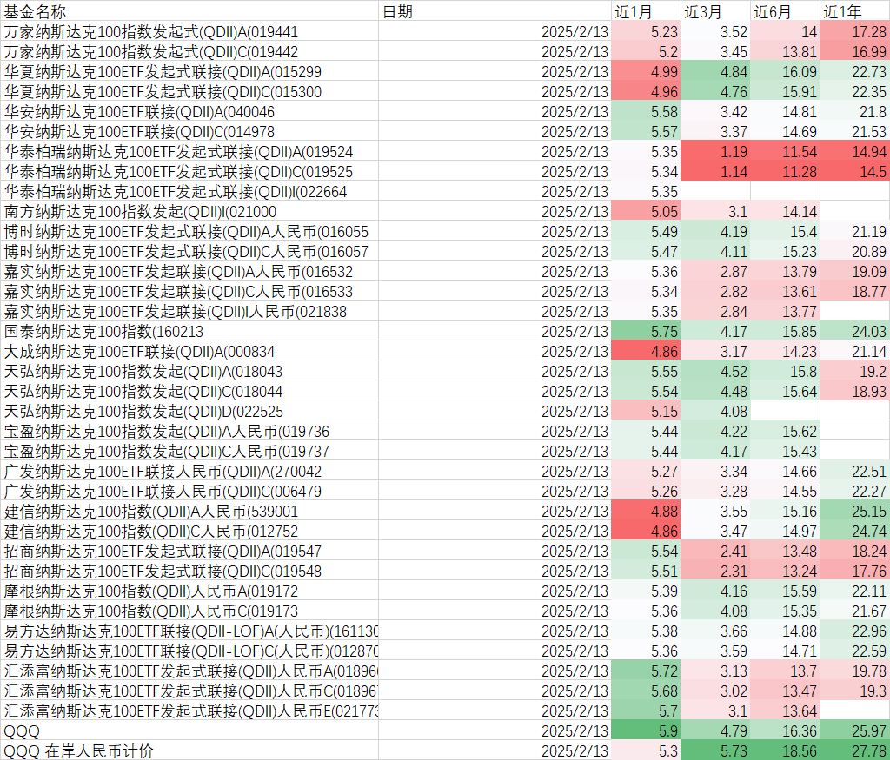

# QDII基金NDX100收益率比较

最近，QDII基金陆续恢复申购，我想比较几家主流的跟踪 NDX100 的 QDII 基金进行收益率。我编写了一个简单的Python脚本，从天天基金网抓取了相关基金的收益率信息。


脚本运行后，我得到了以下基金的收益率数据，以 QQQ 为业绩比较基准，



总的来说，各家基金的表现差异不大。目前QDII基金普遍限购，能够买到就已经不错了，避开少数表现不佳的基金即可。


### 代码片段

```python
import asyncio
import pandas as pd
import aiohttp
from bs4 import BeautifulSoup
import re

pl_pattern = r"(近1月|近1年|近3月|近3年|近6月|成立来)：(-?\d+(\.\d+)?)%"
date_pattern = r"\d{4}-\d{2}-\d{2}"
基金编号 = [
    "270042", "000834", "161130", "040048", "014978", "159501", "012752", "040047", "006480", "016532",
    "016055", "016057", "019548", "019737", "018966", "019736", "021000", "016535", "012753", "019738",
    "021838", "019525", "160213", "040046", "006479", "539001", "016533", "159513", "513870", "015300",
    "019172", "019173", "019442", "012870", "012871", "012751", "015518", "016056", "018969", "022525",
    "019175", "019739", "513100", "159941", "513300", "159632", "159660", "159659", "003722", "018044",
    "513110", "015299", "159696", "018043", "018967", "019441", "019524", "019547", "000055", "021773",
    "016534", "016058", "019174", "022664", "023422",
]
endpoint = "https://fund.eastmoney.com/{code}.html"

async def fetch(session, url):
    async with session.get(url) as response:
        response.raise_for_status()
        text = await response.text()
        soup = BeautifulSoup(text, "html.parser")

        value_element = soup.select_one(
            "#body > div:nth-child(11) > div > div > div.fundDetail-main > div.fundInfoItem > div.dataOfFund"
        )
        title_element = soup.select_one(
            "#body > div:nth-child(11) > div > div > div.fundDetail-header > div.fundDetail-tit > div"
        )
        status_element = soup.select_one(
            "#body > div:nth-child(11) > div > div > div.fundDetail-main > div.choseBuyWay.notForSale > div.buyWayWrap > div.buyWayStatic > div:nth-child(1),"
            "#body > div:nth-child(11) > div > div > div.fundDetail-main > div.choseBuyWay.canBuy > div.buyWayWrap > div.buyWayStatic > div:nth-child(1)"
        )
        date_element = soup.select_one(
            "#body > div:nth-child(11) > div > div > div.fundDetail-main > div.fundInfoItem > div.dataOfFund > dl.dataItem02 > dt > p"
        )
        if all(map(lambda x: x is not None, (value_element, title_element))):
            matches = re.findall(pl_pattern, value_element.get_text(strip=True))
            value = {}
            title = title_element.get_text(strip=True)
            date = date_element.get_text(strip=True)
            date = re.findall(date_pattern, date)

            print(title, date)
            for category, percentage, _ in matches:
                value[category] = percentage
            if status_element is not None:
                value["状态"] = status_element.get_text(strip=True)
            if date:
                value["日期"] = date[0]
            return title, value
        raise ValueError(f"{url} not found valid element")

async def fetch_all(urls):
    async with aiohttp.ClientSession() as session:
        tasks = [fetch(session, url) for url in urls]
        results = await asyncio.gather(*tasks, return_exceptions=True)
        return results

columns = [
    "基金名称",
    "日期",
    "近1月",
    "近3月",
    "近6月",
    "近1年",
    "近3年",
    "状态",
]
df = pd.DataFrame(columns=columns)

# 生成所有需要抓取的 URL
urls = [endpoint.format(code=code) for code in 基金编号]

# 抓取数据并填充 DataFrame
rows = []
results = asyncio.run(fetch_all(urls))
print(results)
for result in results:
    if isinstance(result, BaseException):
        print(result)
    else:
        title, values = result
        if "美元" in title or "场内" in values.get("状态", ""):
            continue
        row = {col: values.get(col, "") for col in columns[1:]}
        row["基金名称"] = title
        rows.append(row)

# 将所有行合并到 DataFrame 中
rows.sort(key=lambda item: item["基金名称"])
df = pd.concat([df, pd.DataFrame(rows)], ignore_index=True)

# 保存 DataFrame 到 CSV 文件
df.to_csv("fund_data.csv", index=False, encoding="gbk")

print("数据已成功保存到 fund_data.csv")
```